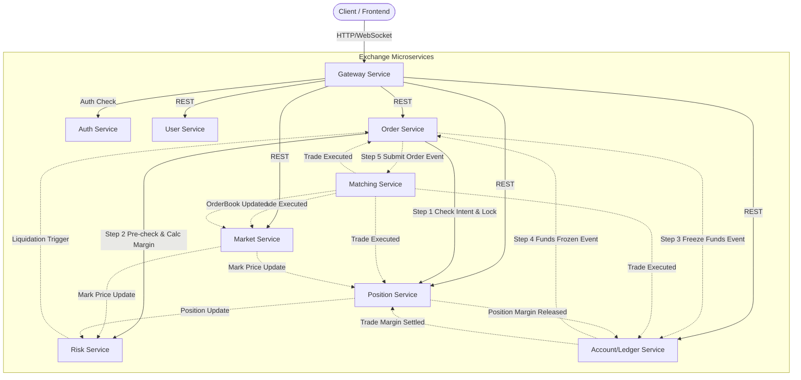

# Open Exchange Core - Crypto Perpetual Exchange Core System

[中文](./README.zh-CN.md) | English

> 🌟 **If you find this project helpful, please give it a Star ⭐ in the top right corner! Your support is our greatest motivation for continuously optimizing the high-performance trading core and AI-driven architecture.**

---

This project is a financial trading core system designed for high-concurrency, low-latency scenarios. Through self-developed distributed protocols and in-memory matching technology, it addresses the pain points of consistency, scalability, and auditing faced by modern exchanges.

## 🚀 Core Technical Features

### ⚡ Extreme Performance & Deterministic Link
* **LMAX Deterministic Matching Engine**: Adopts the **LMAX Disruptor** architectural pattern, maximizing single-core throughput through lock-free buffers to achieve microsecond-level deterministic matching latency.
* **Single WAL Write & Snapshot Recovery**: Optimized IO link implements **single WAL (Write-Ahead Logging) sequential writes**, minimizing disk IO impact while ensuring strong persistence. Combined with a snapshot mechanism, it achieves second-level disaster recovery.
    * 🎥 [WAL Disaster Recovery Test Demo](https://youtu.be/2DiLnHr8UyU)
* **High Concurrency & Architectural Decoupling**: Core links (matching, settlement, risk control, consistency) are fully decoupled, supporting horizontal expansion of trading clusters for market data and asset services.
    * 🎥 [Automated Integration Test Trading Link Demo](https://youtu.be/vrGdCa37e58)

### 🤖 AI-Driven Architecture (AI-Friendly SDK)
* **Context Payload Minimization**: Complex framework configurations and underlying logic are encapsulated within the SDK. AI Agents only need to understand concise standardized interfaces to write code, significantly saving token consumption and improving generation accuracy.
* **Structured Data Correlation**: Fully adopts standardized Event encapsulation and automatic Trace ID injection. By establishing correlations between data, it assists AI in more accurately understanding business processes and performing automated fault localization.
* **Single Source of Truth (SSOT)**: Through interface sharing technology, 100% synchronization of validation rules between client and server is achieved, reducing AI's redundant understanding and communication costs during cross-service development.
* **High-Level Logic Abstraction (Task Wrapper)**: Provides a dedicated `task-service` to encapsulate distributed transaction state management, allowing AI to focus on developing core business logic without being distracted by complex state transitions.
    * 🎥 [Architectural Design in the AI Era: How SDKs Become the Core](https://youtu.be/-ydshcOc_1w)

### 💰 Financial Grade Accounting & Dynamic Balance Sheet
* **Dynamic Balance Sheet Modeling**: Built-in exchange-grade financial accounting module supporting dynamic modeling of various digital assets. This architecture can actively locate anomalies through data correlation, transforming "post-audit" into "real-time risk control."
    * 🎥 [Real-time Balance Sheet Operation Demo](https://youtu.be/21zo-qki7sw)
* **Multi-dimensional Automated Reconciliation (Future-Ready)**: Deep data correlation foundations have been built, supporting future expansion to multi-level verification including matching logs, wallet balances, accounting entries, and third-party settlements, achieving data consistency self-healing.
* **Professional Audit & Tracking Empowerment**: Provides audit tools required by professional accountants, supporting deep tracking using double-entry bookkeeping techniques, capable of reconstructing financial snapshots at any moment to ensure 100% data integrity and traceability.
* **Full-Scenario Account View**: Provides a highly structured panoramic display for multi-currency and multi-position assets, assisting financial teams in achieving second-level reconciliation and reducing manual audit costs to near zero.

### 🛡️ Distributed Consistency: Self-developed Flip Protocol
* **"Invisible Scheduling" to End Resource Contention**: Implements a distributed transaction protocol based on **Flip Logic**, specifically designed to handle the toughest **Resource Stealing** dilemmas in distributed environments. It acts like an intelligent brain, resolving contention for the same resource across multiple nodes within milliseconds.
    * 🎥 [Flip Protocol Logic Analysis and Implementation](https://youtu.be/9Q0PC63rT1Q)
* **Breaking Performance Bottlenecks with Eventual Consistency**: Unlike the heavy burden of traditional consensus protocols, Flip Protocol maintains financial-grade **eventual consistency** and **transaction atomicity** while sustaining incredible throughput.

### 🌐 Responsive Web Trading Terminal
* **Modern Trading Experience**: A high-performance trading interface built with **React 19**, **Ant Design 5**, and **Tailwind CSS**, supporting responsive layout and dark mode.
* **Clean & Efficient Interaction**: Data synchronization is achieved through an optimized REST polling mechanism, ensuring good data real-time performance while minimizing system load.
    * 🎥 [Web Trading Terminal Demo (React / Ant Design)](https://youtu.be/480WEYdAXf4)

### ☸️ Cloud-Native DevOps
* **Extreme Development Experience**: Provides one-click K8s cluster setup, direct remote K8s debugging from IDEA, unified configuration across all environments, and intelligent CI/CD processes.
    * 🎥 [K8s Cluster Rapid Deployment in Action](https://youtu.be/93OI84tf7xY)
* **Precise Resource Control**: Through deep optimization, the entire cluster can run stably on just [**8.3 GB of memory**](https://1drv.ms/i/c/095e0f59106abb25/IQC4eVXKMxlLQYRJIKax9TRiAem6GldZCpNL-5IgXm8Gz2A?e=2ccROi).
* **Comprehensive Observability**: Integrated high-performance monitoring SDK, automated alerting, and scaling mechanisms, fully covering matching scenarios and asset account reconciliation.
    * 🎥 [High-Performance Full-Stack Monitoring and Metric Governance](https://youtu.be/VfIl151yjds)

---

## 🏗️ System Architecture

The system is built using asynchronous event-driven patterns and the strong consistency protocol (Flip Protocol), ensuring high throughput in the trading link and asset security.



## 📦 Core Services

| Service Name | Description |
| :--- | :--- |
| **`Matching`** | **Core Matching Engine**: High-performance in-memory matching system based on LMAX Disruptor. |
| **`Order`** | **Order Management**: Handles order lifecycle, validation, and state transitions. |
| **`User / Auth`** | **User & Auth**: User profile management and JWT-based secure authentication. |
| **`Account`** | **Asset Accounting**: Responsible for clearing, settlement, and financial-grade double-entry bookkeeping. |
| **`Position`** | **Position Management**: Maintains user positions, liquidation price calculation, and margin validation. |
| **`Risk`** | **Risk Control**: Dynamically calculates account risk metrics, executes liquidation orders, and risk alerts. |
| **`Market`** | **Market Service**: Aggregates trade data, providing K-line, order book, and mark price pushes. |
| **`Gateway`** | **Unified Gateway**: Request routing, load balancing, CORS handling, and rate limiting. |

---

## 🛠️ Getting Started & Environment Setup

This project provides highly automated build scripts, requiring only a few steps to pull up the complete exchange infrastructure locally.

### 1. Prepare Environment
* **OS**: Linux or macOS recommended (Windows users please use WSL2).
* **Necessary Tools**:
    * **JDK 21+** (Temurin recommended).
    * **Docker** & **kind** (for building local K8s clusters).
    * **kubectl**

### 2. Quick Start Cluster
```bash
# 1. Create K8s cluster
kind create cluster --name exchange

# 2. Run one-click start script
bash ./script/cluster-up.sh
```
The script provides the following options (can be combined, e.g., `123`):
* **Option 1: Default Infra** - Automatically builds Ingress, Nacos, MySQL, Redis, Kafka, etc.
    * *Dependencies*: `kubectl`, `docker`
* **Option 2: ArgoCD** - Automatically installs and configures the GitOps environment.
    * *Dependencies*: `kubectl`, `argocd` CLI, `nc` (netcat)
* **Option 3: Monitoring** - Deploys Prometheus, Grafana, and Alertmanager.
    * *Dependencies*: `kubectl`

> 💡 **Tip**: For detailed steps, refer to [Manual Build Document](doc/手動建置.md).

### 3. Local Direct Connection to K8S Debugging (Telepresence)
To allow the development machine to directly access K8S internal services (e.g., `*.cluster.local`) and debug directly from the IDE, it is recommended to install Telepresence:
* **Install (Linux)**:
  ```bash
  sudo curl -fL https://app.getambassador.io/download/tel2/linux/amd64/latest/telepresence -o /usr/local/bin/telepresence
  sudo chmod a+x /usr/local/bin/telepresence
  ```
* **Deploy Traffic Manager to Cluster**:
  ```bash
  telepresence helm install
  ```
* **Connect to Cluster**:
  ```bash
  telepresence connect
  ```
* **Effect**: After connecting, you can directly access `http://infra-nacos.default.svc.cluster.local:8848` or run services in your local IDE and connect directly to databases and middleware within K8S.

### 4. Start WEB Service & Access
1. **Enter Frontend Directory**: `cd service/exchange/exchange-web`.
2. **Quick Start**: Run `bash quick-start.sh`. This script will automatically install dependencies and guide you to set the backend API address (default is `http://localhost:12345`).
3. **Browse**: Open `http://localhost:5173` to enter the exchange interface.
4. **Demo Link**: 🎥 [Web Trading Terminal Interaction Demo (React)](https://youtu.be/480WEYdAXf4)

### 5. Access Monitoring Dashboards
After starting Telepresence, you can access directly via the following URLs (no extra Hosts configuration needed):
* **Grafana**: `http://grafana.monitoring.svc.cluster.local:3000` (User/Pass: `admin/admin123`)
* **Prometheus**: `http://prometheus.monitoring.svc.cluster.local:9090`
* **Nacos**: `http://infra-nacos.default.svc.cluster.local:8848`
* **Redpanda (Kafka UI)**: `http://redpanda-console.default.svc.cluster.local:8080`


---

## 📄 License
This project is licensed under the [Apache-2.0 License](LICENSE.md).


## Author's Note
If you want to do your own Java project experiments, but infra and framework configuration take up too much of your time, feel free to fork this project. I hope it saves you time.

The project structure was designed to be multi-project compatible from the start, so it is very easy to remove my project and leave only the base frameworks like infra and SDK.

It provides one-click construction of all nacos, redis, mysql, kafka clusters, monitoring and alerting, etc. It also provides IDEA direct connection to K8S, and an AI-friendly SDK.

This project was originally used for my overseas job search. I chose this topic because I have future experimental projects that can be built on the foundation of an exchange.

So if you have some topics, or want to implement certain exchange business functions, you can also implement them directly on this. You can also optimize my SDK as a toolkit for your new company.

I hope the foundation I spent some time building can be helpful to everyone, so you don't have to reinvent these wheels.

The cluster has been optimized, and the overall startup uses about 6~8 GB of memory, suitable for development on a 32GB RAM computer.


## Install

```bash
mnv package
cd script
docker pull nacos/nacos-server:v2.4.3
chmod +x cluster-up.sh
./cluster-up.sh

telepresence connect --mapped-namespaces default

mvn clean install
cd ..
cd service/exchange/exchange-web
./quick-start.sh
```


```bash
kubectl apply -f k8s/service-exchange/exchange-account.yaml
kubectl apply -f k8s/service-exchange/exchange-auth.yaml
kubectl apply -f k8s/service-exchange/exchange-gateway.yaml
kubectl apply -f k8s/service-exchange/exchange-market.yaml
kubectl apply -f k8s/service-exchange/exchange-matching.yaml
kubectl apply -f k8s/service-exchange/exchange-order.yaml
kubectl apply -f k8s/service-exchange/exchange-position.yaml
kubectl apply -f k8s/service-exchange/exchange-risk.yaml
kubectl apply -f k8s/service-exchange/exchange-user.yaml
kubectl apply -f k8s/service-exchange/exchange-admin.yaml

kind load docker-image exchange-account:latest --name exchange
kind load docker-image exchange-auth:latest --name exchange
kind load docker-image exchange-gateway:latest --name exchange
kind load docker-image exchange-market:latest --name exchange
kind load docker-image exchange-matching:latest --name exchange
kind load docker-image exchange-order:latest --name exchange
kind load docker-image exchange-position:latest --name exchange
kind load docker-image exchange-risk:latest --name exchange
kind load docker-image exchange-user:latest --name exchange
kind load docker-image exchange-admin:latest --name exchange
```

## Result

```bash
Cluster endpoints are ready. Access services using in-cluster DNS:
  Ingress: http://ingress-nginx-controller.ingress-nginx.svc.cluster.local/
  MySQL primary: infra-mysql-0.infra-mysql-headless.default.svc.cluster.local:3306
  MySQL secondary: infra-mysql-1.infra-mysql-headless.default.svc.cluster.local:3306
    root password: root
    app user/password: app_user / app_user
  Redis cluster: infra-redis.default.svc.cluster.local:6379
  Kafka broker: infra-kafka.default.svc.cluster.local:9092
  Kafka Connect REST: http://infra-kafka-connect.default.svc.cluster.local:8083
  Redpanda Console: http://redpanda-console.default.svc.cluster.local:8080
  Nacos console: http://infra-nacos.default.svc.cluster.local:8848
  Argo CD API/UI: https://argocd-server.argocd.svc.cluster.local
    argocd admin/password: admin / dni3DBnR-XuY2kLs
  Prometheus: http://prometheus.monitoring.svc.cluster.local:9090
  Alertmanager: http://alertmanager.monitoring.svc.cluster.local:9093
  Grafana: http://grafana.monitoring.svc.cluster.local:3000
    grafana admin/password: admin / admin123
```

## Usage

腳本執行後，可透過 Kubernetes DNS 直接訪問以下服務（請先確保本機能解析 `*.svc.cluster.local`，例如使用 Telepresence）：

- Ingress 控制器：`http://ingress-nginx-controller.ingress-nginx.svc.cluster.local`
- Argo CD：`https://argocd-server.argocd.svc.cluster.local`
- Prometheus：`http://prometheus.monitoring.svc.cluster.local:9090`
- Alertmanager：`http://alertmanager.monitoring.svc.cluster.local:9093`
- Grafana：`http://grafana.monitoring.svc.cluster.local:3000`
- Nacos：`http://infra-nacos.default.svc.cluster.local:8848/nacos`
- MySQL：
    - `infra-mysql-0.infra-mysql-headless.default.svc.cluster.local:3306`（帳號/密碼 `root/root`）
    - `infra-mysql-1.infra-mysql-headless.default.svc.cluster.local:3306`（帳號/密碼 `root/root`）
- Redis Cluster：
    - `redis-cli -h infra-redis.default.svc.cluster.local -p 6379`
    - 或使用 Pod DNS：`infra-redis-{0..2}.infra-redis-headless.default.svc.cluster.local`
- Kafka Broker：`kafka-topics.sh --bootstrap-server infra-kafka.default.svc.cluster.local:9092 --list`
- Redpanda Console：`http://redpanda-console.default.svc.cluster.local:8080`
